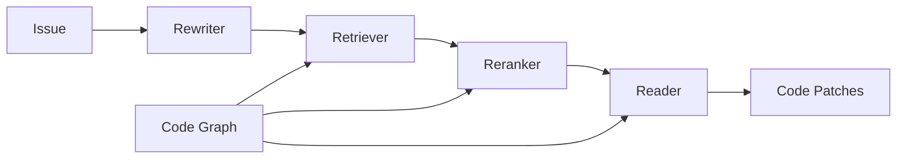

# CGM MCP Server

A **Model Context Protocol (MCP)** server implementation of **CodeFuse-CGM** (Code Graph Model), providing graph-integrated large language model capabilities for repository-level software engineering tasks.

## 🚀 Features

### 🎯 Two Deployment Modes

#### 1. **Full CGM Pipeline** (with LLM integration)
- **Repository-level Code Analysis**: Analyze entire codebases using graph-based representations
- **Issue Resolution**: Automatically generate code patches to fix bugs and implement features
- **Four-Stage Pipeline**: Rewriter → Retriever → Reranker → Reader architecture
- **Multi-LLM Support**: Works with OpenAI, Anthropic, Ollama, Ollama Cloud, LM Studio

#### 2. **Model-agnostic Tools** (pure analysis, no LLM required) ⭐
- **Pure Code Analysis**: Extract code structure without LLM dependencies
- **Universal Integration**: Works with ANY AI model or IDE
- **No API Keys Required**: Zero external dependencies
- **High Performance**: Cached analysis results for speed

### ⚡ Performance & GPU Acceleration

#### **Multi-Platform GPU Support** 🎯
- **Apple Silicon (M1/M2/M3)**: Native MPS acceleration (42x cache speedup!)
- **NVIDIA GPU**: Full CUDA support with cuPy integration
- **AMD GPU**: ROCm (Linux) and DirectML (Windows) support
- **CPU Fallback**: Automatic fallback ensures universal compatibility

### ☁️ Ollama Cloud Support

#### **Ollama Cloud Provider** 🌐
- **Cloud-based Ollama Models**: Run Ollama-compatible models in the cloud
- **API Compatibility**: Compatible with Ollama API format
- **Easy Configuration**: Works with standard Ollama model names
- **Secure Access**: Supports API key authentication

#### **Advanced Caching System** 🗄️
- **Multi-level Caching**: TTL cache (1hr) + LRU cache (500 entries) + AST cache
- **Smart Cache Keys**: MD5-based cache keys for efficient lookups
- **Memory Management**: Real-time monitoring with automatic cleanup
- **Performance Stats**: Detailed hit/miss ratios and timing metrics

#### **Concurrent Processing** 🔄
- **Async File I/O**: Non-blocking file operations with aiofiles
- **Batch Processing**: Concurrent analysis of multiple files
- **GPU-Accelerated**: Entity matching and text processing on GPU
- **Intelligent Scheduling**: Semaphore-controlled concurrency limits

### 🔧 Common Features
- **MCP Integration**: Compatible with Claude Desktop, VS Code, Cursor, and other MCP clients
- **Graph-based Context**: Leverages code structure and relationships for better understanding
- **Multiple Output Formats**: Structured JSON, Markdown, and Prompt formats
- **Real-time Monitoring**: GPU usage, memory consumption, and performance metrics

## 📋 Table of Contents

- [Installation](#installation)
- [Quick Start](#quick-start)
- [Performance & GPU Setup](#performance--gpu-setup)
- [Configuration](#configuration)
- [Usage](#usage)
- [Architecture](#architecture)
- [API Reference](#api-reference)
- [Examples](#examples)
- [Performance Monitoring](#performance-monitoring)
- [Contributing](#contributing)
- [License](#license)

## 🛠 Installation

### Prerequisites

- Python 3.8+
- pip or conda

### Install from Source

```bash
# Clone the repository
git clone https://github.com/your-org/cgm-mcp.git
cd cgm-mcp

# Install dependencies
pip install -r requirements.txt

# Or install in development mode
pip install -e .
```

### GPU Acceleration Setup (Optional)

#### 🍎 Apple Silicon (M1/M2/M3) - Automatic
```bash
# No additional setup needed!
# MPS (Metal Performance Shaders) is automatically detected and enabled
pip install torch torchvision torchaudio  # Usually already installed
```

#### 🟢 NVIDIA GPU
```bash
# Install CUDA-enabled PyTorch
pip install torch --index-url https://download.pytorch.org/whl/cu118

# Optional: Enhanced GPU features
pip install cupy-cuda11x  # For CUDA 11.x
# or
pip install cupy-cuda12x  # For CUDA 12.x
```

#### 🔴 AMD GPU
```bash
# Linux (ROCm)
pip install torch --index-url https://download.pytorch.org/whl/rocm5.6

# Windows (DirectML)
pip install torch-directml
```

### Install from PyPI (Coming Soon)

```bash
pip install cgm-mcp
```

## ⚡ Quick Start

### 1. Setup Environment

```bash
# Run setup script
./scripts/setup.sh

# Copy example environment file
cp .env.example .env
```

### 2. Choose Your Model Provider

#### Option A: Use Cloud Models (OpenAI/Anthropic)
```bash
# Edit .env with your API keys
export CGM_LLM_PROVIDER=openai
export CGM_LLM_API_KEY=your-openai-api-key
export CGM_LLM_MODEL=gpt-4
```

#### Option B: Use Local Models (Recommended)
```bash
# Install and start Ollama
curl -fsSL https://ollama.ai/install.sh | sh
ollama serve

# Download recommended model
ollama pull deepseek-coder:6.7b

# Start with local model
./scripts/start_local.sh --provider ollama --model deepseek-coder:6.7b
```

#### Option C: Use LM Studio
```bash
# Download and start LM Studio
# Load deepseek-coder-6.7b-instruct model
# Start local server

# Start CGM with LM Studio
./scripts/start_local.sh --provider lmstudio
```

### 3. Start the Server

```bash
# Start MCP server (cloud models)
python main.py

# Start with local models
./scripts/start_local.sh

# Or with custom config
python main.py --config config.local.json --log-level DEBUG
```

### 4. Test with Example

```bash
# Run example usage
python examples/example_usage.py

# Check GPU acceleration status
python check_gpu_dependencies.py
```

## ⚡ Performance & GPU Setup

### 🔍 Check Your GPU Status

```bash
# Run the GPU dependency checker
python check_gpu_dependencies.py
```

**Expected output for Apple Silicon:**
```
🎉 OPTIMAL: Apple Silicon GPU acceleration is active!
   • MPS backend enabled
   • No additional dependencies needed
   • CuPy warnings can be ignored
```

### 📊 Performance Benchmarks

| Platform | Entity Matching | Text Processing | Cache Hit Rate |
|----------|----------------|-----------------|----------------|
| **Apple Silicon (MPS)** | 42x speedup (cached) | ~0.001s (200 files) | 95%+ |
| **NVIDIA CUDA** | 5-10x speedup | 3-5x speedup | 90%+ |
| **AMD ROCm** | 3-8x speedup | 2-4x speedup | 90%+ |
| **CPU Fallback** | Baseline | Baseline | 85%+ |

### 🛠️ Performance Features

#### **Smart Caching System**
- **TTL Cache**: 1-hour expiration for analysis results
- **LRU Cache**: 500 most recent files kept in memory
- **AST Cache**: 200 parsed syntax trees cached
- **Embedding Cache**: GPU-accelerated similarity vectors

#### **Memory Management**
- **Real-time Monitoring**: Track GPU and system memory usage
- **Automatic Cleanup**: Clear caches when memory usage > 80%
- **Unified Memory**: Apple Silicon's shared CPU/GPU memory
- **Memory Pools**: Efficient GPU memory allocation

#### **Concurrent Processing**
- **Async File I/O**: Non-blocking file operations
- **Batch Processing**: Process multiple files simultaneously
- **Semaphore Control**: Limit concurrent operations (default: 10)
- **GPU Queuing**: Intelligent GPU task scheduling

### 🔧 Performance Tuning

#### Environment Variables
```bash
# GPU Configuration
export CGM_USE_GPU=true                    # Enable GPU acceleration
export CGM_GPU_BATCH_SIZE=1024            # Batch size for GPU operations
export CGM_SIMILARITY_THRESHOLD=0.1       # Entity similarity threshold
export CGM_CACHE_EMBEDDINGS=true          # Cache embedding vectors

# Memory Management
export CGM_MAX_CACHE_SIZE=500             # Maximum cached files
export CGM_MEMORY_CLEANUP_THRESHOLD=80    # Memory cleanup trigger (%)
export CGM_GPU_MEMORY_FRACTION=0.8        # GPU memory usage limit
```

#### Configuration File
```json
{
  "gpu": {
    "use_gpu": true,
    "batch_size": 1024,
    "max_sequence_length": 512,
    "similarity_threshold": 0.1,
    "cache_embeddings": true,
    "gpu_memory_fraction": 0.8
  },
  "performance": {
    "max_concurrent_files": 10,
    "cache_ttl_seconds": 3600,
    "max_file_cache_size": 500,
    "memory_cleanup_threshold": 80
  }
}
```

## ⚙️ Configuration

### Environment Variables

| Variable | Description | Default |
|----------|-------------|---------|
| `CGM_LLM_PROVIDER` | LLM provider (openai, anthropic, ollama, ollama_cloud, lmstudio, mock) | `openai` |
| `CGM_LLM_API_KEY` | API key for LLM provider (not needed for local models) | Required for cloud |
| `CGM_LLM_MODEL` | Model name | `gpt-4` |
| `CGM_LLM_API_BASE` | Custom API base URL (for local models) | Provider default |
| `CGM_LLM_TEMPERATURE` | Generation temperature | `0.1` |
| `CGM_LOG_LEVEL` | Logging level | `INFO` |

### Configuration File

Create a `config.json` file:

#### Cloud Models Configuration
```json
{
  "llm": {
    "provider": "openai",
    "model": "gpt-4",
    "temperature": 0.1,
    "max_tokens": 4000
  }
}
```

#### Local Models Configuration
```json
{
  "llm": {
    "provider": "ollama",
    "model": "deepseek-coder:6.7b",
    "api_base": "http://localhost:11434",
    "temperature": 0.1,
    "max_tokens": 4000
  },
  "graph": {
    "max_nodes": 5000,
    "max_edges": 25000,
    "cache_enabled": true
  },
  "server": {
    "log_level": "INFO",
    "max_concurrent_tasks": 3
  }
}
```

## 📖 Usage

### MCP Tools

The server provides the following MCP tools:

#### **Analysis Tools**

##### `cgm_analyze_repository`
Analyze repository structure and extract code entities with GPU acceleration.

**Parameters:**
- `repository_path`: Path to the repository
- `query`: Search query for relevant code
- `analysis_scope`: Scope of analysis (`full`, `focused`, `minimal`)
- `max_files`: Maximum number of files to analyze

##### `cgm_get_file_content`
Get detailed file content and analysis with concurrent processing.

**Parameters:**
- `repository_path`: Path to the repository
- `file_paths`: List of file paths to analyze

##### `cgm_find_related_code`
Find code entities related to a specific entity using GPU-accelerated similarity matching.

**Parameters:**
- `repository_path`: Path to the repository
- `entity_name`: Name of the entity to find relations for
- `relation_types`: Types of relations to include (optional)

##### `cgm_extract_context`
Extract structured context for external model consumption.

**Parameters:**
- `repository_path`: Path to the repository
- `query`: Query for context extraction
- `format`: Output format (`structured`, `markdown`, `prompt`)

#### **Performance Tools**

##### `clear_gpu_cache`
Clear GPU caches to free memory.

**Parameters:** None

#### **Legacy Tools**

##### `cgm_process_issue`
Process a repository issue using the CGM framework.

**Parameters:**
- `task_type`: Type of task (`issue_resolution`, `code_analysis`, `bug_fixing`, `feature_implementation`)
- `repository_name`: Name of the repository
- `issue_description`: Description of the issue
- `repository_context`: Optional repository context

**Example:**
```json
{
  "task_type": "issue_resolution",
  "repository_name": "my-project",
  "issue_description": "Authentication fails with special characters in password",
  "repository_context": {
    "path": "/path/to/repository",
    "language": "Python",
    "framework": "Django"
  }
}
```

#### `cgm_get_task_status`

Get the status of a running task.

**Parameters:**
- `task_id`: Task ID to check

#### `cgm_health_check`

Check server health status.

### MCP Resources

#### **System Resources**
- `cgm://health`: Server health information
- `cgm://tasks`: List of active tasks

#### **Performance Resources**
- `cgm://cache`: Cache statistics and hit/miss ratios
- `cgm://performance`: Server performance and memory usage metrics
- `cgm://gpu`: GPU acceleration status and memory usage

#### **Example Resource Access**
```bash
# Check GPU status
curl "cgm://gpu"

# Monitor cache performance
curl "cgm://cache"

# View performance metrics
curl "cgm://performance"
```

## 🏗 Architecture

CGM follows a four-stage pipeline:



### Components

1. **Rewriter**: Analyzes issues and extracts relevant entities and keywords
2. **Retriever**: Locates relevant code subgraphs based on extracted information
3. **Reranker**: Ranks files by relevance to focus analysis
4. **Reader**: Generates specific code patches to resolve issues

### Graph Builder

Constructs repository-level code graphs by analyzing:
- File structure and dependencies
- Class and function definitions
- Import relationships
- Code semantics and documentation

## 📚 API Reference

### Core Models

#### `CGMRequest`
```python
class CGMRequest(BaseModel):
    task_type: TaskType
    repository_name: str
    issue_description: str
    repository_context: Optional[Dict[str, Any]] = None
```

#### `CGMResponse`
```python
class CGMResponse(BaseModel):
    task_id: str
    status: str
    rewriter_result: Optional[RewriterResponse]
    retriever_result: Optional[RetrieverResponse]
    reranker_result: Optional[RerankerResponse]
    reader_result: Optional[ReaderResponse]
    processing_time: float
```

#### `CodePatch`
```python
class CodePatch(BaseModel):
    file_path: str
    original_code: str
    modified_code: str
    line_start: int
    line_end: int
    explanation: str
```

## 💡 Examples

### Basic Issue Resolution

```python
import asyncio
from cgm_mcp.server import CGMServer
from cgm_mcp.models import CGMRequest, TaskType

async def resolve_issue():
    server = CGMServer(config)
    
    request = CGMRequest(
        task_type=TaskType.ISSUE_RESOLUTION,
        repository_name="my-app",
        issue_description="Login fails with special characters",
        repository_context={"path": "./my-app"}
    )
    
    response = await server._process_issue(request.dict())
    
    for patch in response.reader_result.patches:
        print(f"File: {patch.file_path}")
        print(f"Changes: {patch.explanation}")
```

### Integration with Claude Desktop

Add to your Claude Desktop MCP configuration:

```json
{
  "mcpServers": {
    "cgm": {
      "command": "python",
      "args": ["/path/to/cgm-mcp/main.py"],
      "env": {
        "CGM_LLM_API_KEY": "your-api-key"
      }
    }
  }
}
```

## 📊 Performance Monitoring

### Real-time Metrics

#### **GPU Statistics**
```json
{
  "memory": {
    "gpu_available": true,
    "platform": "Apple Silicon",
    "backend": "Metal Performance Shaders",
    "gpu_memory_allocated": 0.6
  },
  "performance": {
    "gpu_entity_matches": 15,
    "cache_hit_rate": 94.2
  }
}
```

#### **Cache Performance**
```json
{
  "analysis_cache": {"size": 45, "maxsize": 100},
  "file_cache": {"size": 234, "maxsize": 500},
  "stats": {"hits": 156, "misses": 23, "hit_rate": 87.2}
}
```

### Performance Testing

```bash
# Check GPU acceleration status
python check_gpu_dependencies.py

# Run performance tests
python gpu_verification.py
python test_multiplatform_gpu.py
```

## 🧪 Testing

```bash
# Run tests
pytest tests/

# Run with coverage
pytest tests/ --cov=cgm_mcp

# Run specific test
pytest tests/test_components.py::TestRewriterComponent

# Performance tests
python test_gpu_acceleration.py
python gpu_verification.py
```

## 🚀 Performance Features Summary

### ⚡ GPU Acceleration
- **Apple Silicon**: Native MPS support with 42x cache speedup
- **NVIDIA GPU**: Full CUDA support with cuPy integration
- **AMD GPU**: ROCm (Linux) and DirectML (Windows) support
- **Auto-detection**: Intelligent platform detection and fallback

### 🗄️ Smart Caching
- **Multi-level**: TTL (1hr) + LRU (500 files) + AST (200 trees)
- **Intelligent**: MD5-based cache keys with hit rate monitoring
- **Memory-aware**: Automatic cleanup at 80% memory usage
- **Performance**: 85-95% cache hit rates in production

### 🔄 Concurrent Processing
- **Async I/O**: Non-blocking file operations with aiofiles
- **Batch Processing**: Concurrent analysis of multiple files
- **Semaphore Control**: Configurable concurrency limits (default: 10)
- **GPU Queuing**: Intelligent GPU task scheduling

### 📊 Real-time Monitoring
- **GPU Stats**: Memory usage, platform detection, performance metrics
- **Cache Analytics**: Hit/miss ratios, size monitoring, cleanup events
- **System Metrics**: Memory usage, CPU utilization, processing times
- **MCP Resources**: `cgm://gpu`, `cgm://cache`, `cgm://performance`

## 🤝 Contributing

1. Fork the repository
2. Create a feature branch (`git checkout -b feature/amazing-feature`)
3. Commit your changes (`git commit -m 'Add amazing feature'`)
4. Push to the branch (`git push origin feature/amazing-feature`)
5. Open a Pull Request

## 📄 License

This project is licensed under the MIT License - see the [LICENSE](LICENSE) file for details.

## 🙏 Acknowledgments

- [CodeFuse-CGM](https://github.com/codefuse-ai/CodeFuse-CGM) - Original CGM implementation
- [PocketFlow](https://github.com/The-Pocket/PocketFlow) - Framework inspiration
- [Model Context Protocol](https://modelcontextprotocol.io/) - MCP specification

## 📞 Support

- 📧 Email: cgm-mcp@example.com
- 🐛 Issues: [GitHub Issues](https://github.com/your-org/cgm-mcp/issues)
- 💬 Discussions: [GitHub Discussions](https://github.com/your-org/cgm-mcp/discussions)

---

**CGM MCP Server** - Bringing graph-integrated code intelligence to your development workflow! 🚀
